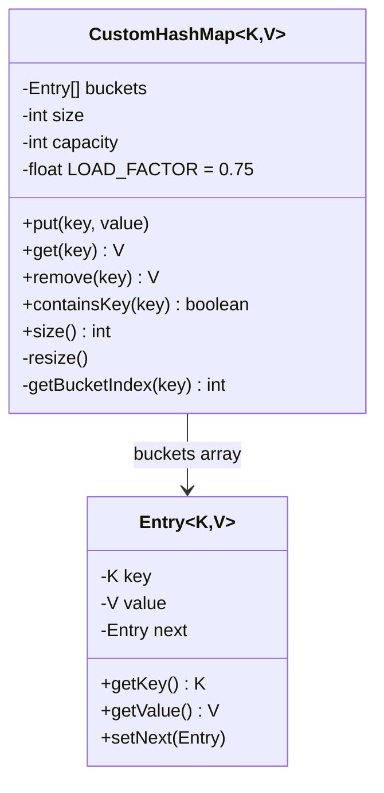

# 🗂️ Custom HashMap — LLD

Design a HashMap from scratch with array + chaining and dynamic resizing.

**Problem Link:** [CodeZym #43](https://codezym.com/question/43)

## Data Structures

| Concept | Purpose | Classes |
|---------|---------|---------|
| **Array of Buckets** | Hash table backing store | `CustomHashMap` |
| **Linked List Chaining** | Collision resolution | `Entry<K,V>` nodes |
| **Dynamic Resizing** | Maintain O(1) average operations | `resize()` at 75% load |

## 🔑 Key Concepts

- **Hash function**: `Math.abs(key.hashCode() % capacity)`
- **Collision resolution**: separate chaining with linked list
- **Load factor**: 0.75 — resize (double capacity) when exceeded
- **Null key support**: maps to bucket index 0
- **Operations**: `put`, `get`, `remove`, `containsKey`, `size`

## 📂 Package Structure

```
CustomHashMap/
├── model/
│   ├── Entry.java         — linked list node: key, value, next
│   └── CustomHashMap.java — array + chaining, resize at 75%
└── CustomHashMapMain.java
```

## 📐 UML Class Diagram



## 🚀 How to Run

```bash
javac -d out $(find CustomHashMap -name "*.java")
java -cp out CustomHashMap.CustomHashMapMain
```

## 📋 Demo Scenarios

1. **Put & Get** — insert key-value pairs, retrieve them
2. **Update** — overwrite existing key
3. **Resize** — automatic doubling at >75% load factor
4. **Remove** — delete entries, verify containsKey
5. **Null key** — null key stored in bucket 0
6. **Integer keys** — 20 entries trigger multiple resizes (4→8→16→32)
