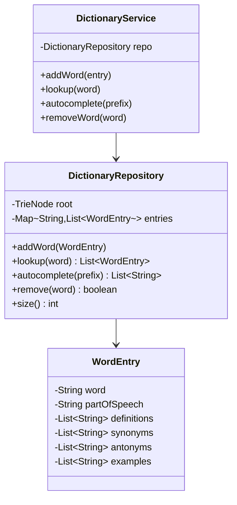

# 📖 Dictionary App — LLD

Design a dictionary application with word lookup, definitions, and autocomplete using a **Trie**.

**Problem Link:** [CodeZym #26](https://codezym.com/question/26)

## Design Patterns & Data Structures

| Concept | Purpose | Classes |
|---------|---------|---------|
| **Trie** | Prefix-based autocomplete & word storage | `DictionaryRepository` (inner `TrieNode`) |
| **Repository Pattern** | Separates data access from business logic | `DictionaryRepository` |

## 🔑 Key Concepts

- **Word entries** with definitions, synonyms, antonyms, part-of-speech, and examples
- **Case-insensitive** lookup and autocomplete
- **Trie-based** prefix search for autocomplete suggestions
- **Multiple definitions** per word (same word, different parts of speech)

## 📂 Package Structure

```
Dictionary/
├── model/
│   └── WordEntry.java       — word, definitions, synonyms, antonyms, examples
├── repository/
│   └── DictionaryRepository.java — Trie-backed storage with insert/search/autocomplete
├── service/
│   └── DictionaryService.java    — business logic layer
└── DictionaryMain.java
```

## 📐 UML Class Diagram



## 🚀 How to Run

```bash
javac -d out $(find Dictionary -name "*.java")
java -cp out Dictionary.DictionaryMain
```

## 📋 Demo Scenarios

1. **Add words** — happy, run (verb & noun), happiness, happen, hash, hashmap
2. **Lookup** — retrieve full definitions, synonyms, antonyms, examples
3. **Autocomplete** — prefix "hap" → [happen, happiness, happy]
4. **Remove** — delete a word and verify autocomplete updates
