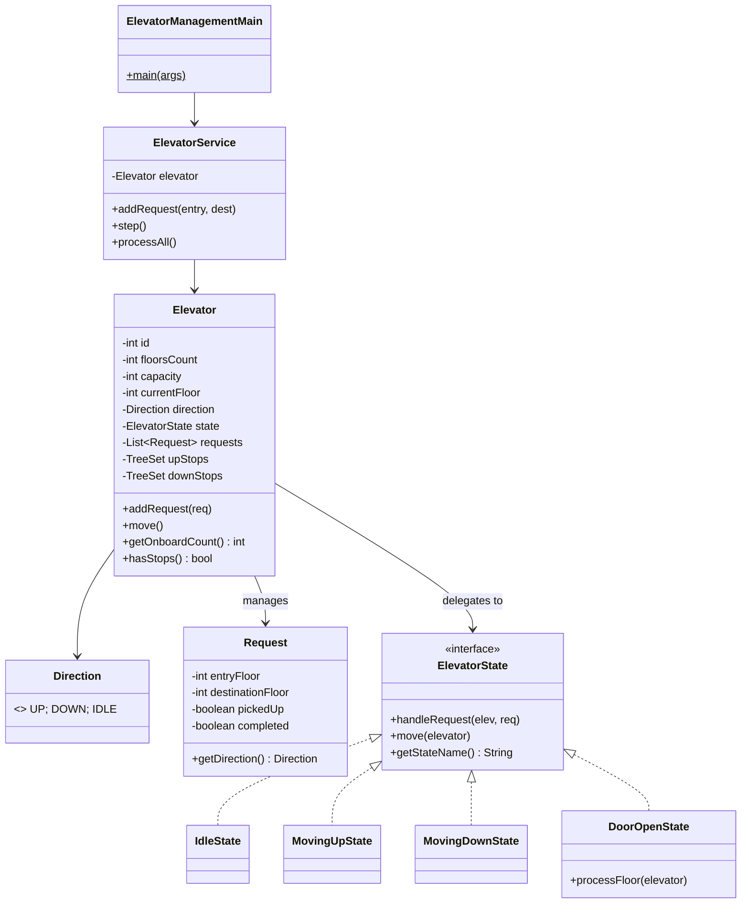

# 🛗 Elevator Management System — Single Lift LLD

Design a simple elevator management system with a single lift using the **State Pattern**.

**Problem Link:** [CodeZym #24](https://codezym.com/question/24)

## Design Patterns Used

| Pattern | Purpose | Classes |
|---------|---------|---------|
| **State** | Elevator behavior changes based on current state (Idle → MovingUp → DoorOpen → MovingDown) | `ElevatorState`, `IdleState`, `MovingUpState`, `MovingDownState`, `DoorOpenState` |

## 🔑 Key Concepts

- **Single lift** in a building with `floorsCount` floors (0..N-1)
- **liftsCapacity**: max passengers at a time
- **LOOK Algorithm**: serve all stops in current direction, then reverse
- **State transitions**: Idle → Moving(Up/Down) → DoorOpen → Moving/Idle

## 📂 Package Structure

```
ElevatorManagement/
├── model/
│   ├── Direction.java  — UP, DOWN, IDLE
│   ├── Request.java    — entryFloor, destinationFloor, pickedUp, completed
│   └── Elevator.java   — context: floor, direction, state, upStops, downStops
├── state/              — State Pattern
│   ├── ElevatorState.java   — interface
│   ├── IdleState.java       — waiting, accepts first request
│   ├── MovingUpState.java   — moving up, visits upStops in order
│   ├── MovingDownState.java — moving down, visits downStops in reverse
│   └── DoorOpenState.java   — pickup/dropoff, then resume direction
├── service/
│   └── ElevatorService.java — orchestrator
└── ElevatorManagementMain.java
```

## 🔄 State Transitions

```
        addRequest()
  ┌──────────┐
  │   IDLE   │───────────────────────────────┐
  └──────┬───┘                               │
         │ request arrives                   │
         ▼                                   │
  ┌──────────────┐    no more up stops    ┌──┴───────────┐
  │  MOVING_UP   │ ─────────────────────▶ │  MOVING_DOWN │
  └──────┬───────┘                        └──────┬───────┘
         │ arrive at stop                        │ arrive at stop
         ▼                                       ▼
  ┌──────────────┐                        ┌──────────────┐
  │  DOOR_OPEN   │                        │  DOOR_OPEN   │
  │  pickup/drop │                        │  pickup/drop │
  └──────┬───────┘                        └──────┬───────┘
         │ doors close                           │ doors close
         ▼                                       ▼
    resume direction                       resume direction
    or switch/idle                         or switch/idle
```

## 📐 UML Class Diagram



## 🚀 How to Run

```bash
javac -d out $(find ElevatorManagement -name "*.java")
java -cp out ElevatorManagement.ElevatorManagementMain
```

## 📋 Demo Scenarios

1. **Simple UP** — 3 passengers all going up
2. **Mixed UP/DOWN** — LOOK algorithm reverses direction
3. **Capacity limit** — 3rd passenger waits when lift is full
4. **DOWN first** — Elevator goes up to pickup, then down
