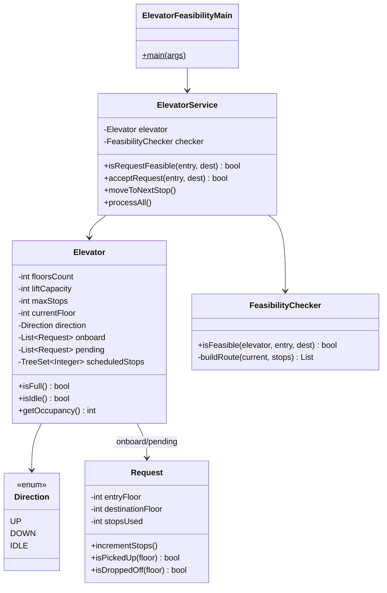

# 🛗 Elevator Request Feasibility (Single Lift) — Low Level Design

Build a controller for a single lift that determines if a new passenger request is feasible given capacity and stop constraints.

**Problem Link:** [CodeZym #23](https://codezym.com/question/23)

## 🔑 Key Concepts

- **floorsCount**: Building has floors `0` to `floorsCount-1`
- **liftCapacity**: Max passengers the lift can carry at once
- **maxStops**: Each passenger must reach from entry to destination within `maxStops` stops
- A new request is **feasible** only if:
  1. Adding it doesn't violate `maxStops` for ANY existing or new passenger
  2. At no point does the lift exceed `liftCapacity`

## 📂 Package Structure

```
ElevatorRequestFeasibility/
├── model/
│   ├── Request.java     — entryFloor, destinationFloor, stopsUsed counter
│   ├── Direction.java   — UP, DOWN, IDLE enum
│   └── Elevator.java    — single lift state: floor, capacity, onboard, pending, stops
├── service/
│   ├── FeasibilityChecker.java — core algorithm: route simulation + constraint check
│   └── ElevatorService.java    — orchestrator: feasibility check, accept, move, process
└── ElevatorFeasibilityMain.java — demo with scenarios
```

## 🔄 Feasibility Algorithm

```
New Request(entry, dest) arrives
    │
    ▼
┌─────────────────────────────┐
│  Build candidate stop set   │──▶ existing stops ∪ {entry, dest}
└─────────┬───────────────────┘
          │
          ▼
┌─────────────────────────────┐
│  Build optimal route        │──▶ sweep UP then DOWN from current floor
└─────────┬───────────────────┘
          │
          ▼
┌─────────────────────────────┐
│  For EACH passenger:        │
│  count stops between        │──▶ if any > maxStops → REJECT
│  their pickup & dropoff     │
└─────────┬───────────────────┘
          │
          ▼
┌─────────────────────────────┐
│  Simulate capacity at each  │──▶ if any moment > liftCapacity → REJECT
│  stop along route           │
└─────────┬───────────────────┘
          │
          ▼
        ACCEPT ✓
```

## 📐 UML Class Diagram



## 🚀 How to Run

```bash
javac -d out $(find ElevatorRequestFeasibility -name "*.java")
java -cp out ElevatorRequestFeasibility.ElevatorFeasibilityMain
```

## 📋 Demo Scenarios

1. **Basic Feasibility** — Multiple requests, check route planning + maxStops
2. **Capacity Check** — Exceed liftCapacity → rejection
3. **maxStops Constraint** — Tight maxStops causes rejection
4. **Invalid Requests** — Same floor, out of bounds
