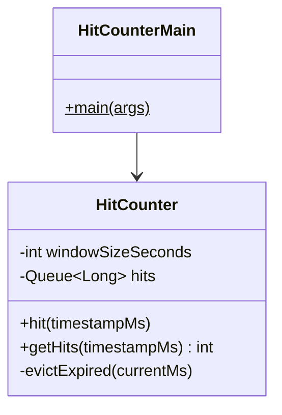

# 🔢 Hit Counter — LLD

Design a hit counter that counts the number of hits in a sliding time window.

**Problem Link:** [CodeZym #10362](https://codezym.com/question/10362)

## Design Patterns & Data Structures

| Concept | Purpose | Classes |
|---------|---------|---------|
| **Sliding Window** | Track hits within last N seconds | `HitCounter` |
| **Queue** | FIFO eviction of expired timestamps | `LinkedList<Long>` |

## 🔑 Key Concepts

- **Sliding window** of configurable size (e.g., 5 seconds)
- **Queue** stores timestamps; expired entries evicted lazily on hit()/getHits()
- **O(1) amortized** for hit(), O(k) for getHits() where k = expired entries
- **Timestamps in milliseconds** for precision

## 📂 Package Structure

```
HitCounter/
├── model/
│   └── HitCounter.java  — Queue-based sliding window counter
└── HitCounterMain.java
```

## 📐 UML Class Diagram



## 🚀 How to Run

```bash
javac -d out $(find HitCounter -name "*.java")
java -cp out HitCounter.HitCounterMain
```

## 📋 Demo Scenarios

1. **Record hits** at t=0,1,1,2,3 → 5 hits in window
2. **Window slides** — after 6s, t=0 hit expired → 3 hits
3. **All expired** — after 10s, all hits outside window → 0
