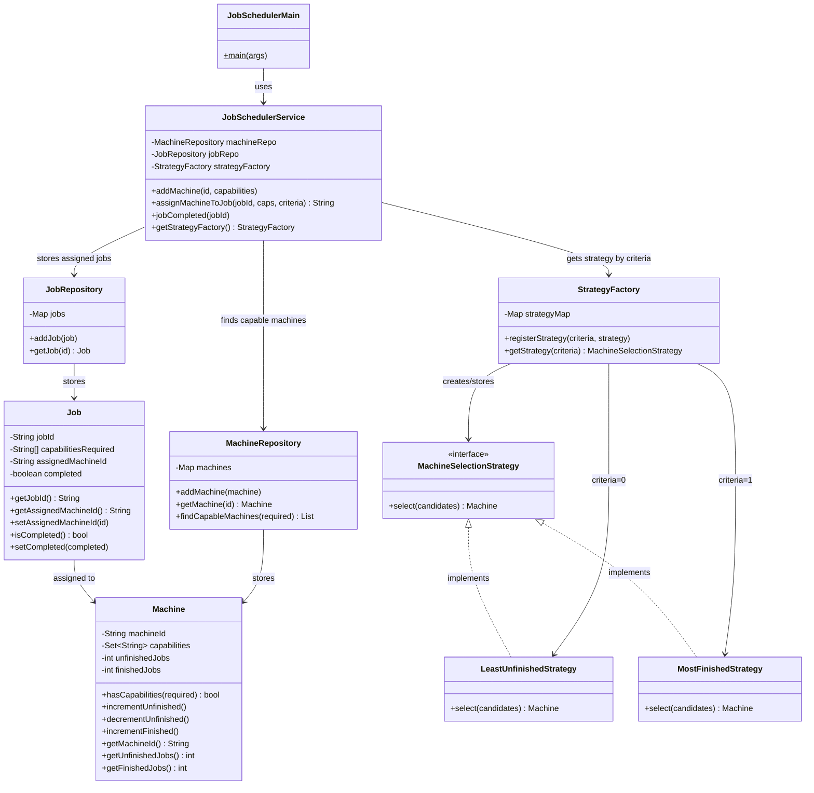

# 🗓️ Job Scheduler — Low Level Design

Design a scheduler for a massively parallel distributed system. The scheduler assigns incoming jobs to machines based on capability matching and pluggable selection criteria.

**Problem Link:** [CodeZym #22](https://codezym.com/question/22)

## Design Patterns Used

| Pattern | Purpose | Classes |
|---------|---------|---------|
| **Strategy** | Pluggable machine selection algorithm (Least Unfinished, Most Finished) — extensible | `MachineSelectionStrategy`, `LeastUnfinishedStrategy`, `MostFinishedStrategy` |
| **Factory** | Maps criteria integer → strategy implementation, supports runtime registration | `StrategyFactory` |

## 🔑 Key Concepts

- **Machines** have a set of **capabilities** (case-insensitive, e.g. "image compression", "audio extraction")
- **Jobs** require a set of capabilities — a job can only run on a machine that has **ALL** required capabilities
- **Selection criteria** determine which eligible machine gets picked:
  - `criteria=0` → **Least Unfinished Jobs** (tie → lexicographically smallest machineId)
  - `criteria=1` → **Most Finished Jobs** (tie → lexicographically smallest machineId)
- **Extensibility**: New criteria are added by implementing `MachineSelectionStrategy` and calling `strategyFactory.registerStrategy(newCriteria, newStrategy)`

## 📂 Package Structure

```
JobScheduler/
├── model/          # Domain entities
│   ├── Machine.java    — machineId, capabilities Set, unfinished/finished counters
│   └── Job.java        — jobId, required capabilities, assigned machine, completion status
├── strategy/       # Strategy Pattern (machine selection algorithms)
│   ├── MachineSelectionStrategy.java   — interface
│   ├── LeastUnfinishedStrategy.java    — criteria=0: fewest unfinished jobs
│   ├── MostFinishedStrategy.java       — criteria=1: most finished jobs
│   └── StrategyFactory.java            — maps criteria int → strategy instance
├── repository/     # Data layer (in-memory storage)
│   ├── MachineRepository.java  — machine storage + capability-based lookup
│   └── JobRepository.java      — job storage + lookup by jobId
├── service/        # Business logic orchestrator
│   └── JobSchedulerService.java — addMachine(), assignMachineToJob(), jobCompleted()
└── JobSchedulerMain.java  # Demo with examples from the problem
```

## 🔄 How Strategy Pattern Works

1. **`JobSchedulerService.assignMachineToJob()`** is called with a `criteria` integer
2. **`MachineRepository`** filters machines that have ALL required capabilities → candidate list
3. **`StrategyFactory.getStrategy(criteria)`** returns the appropriate `MachineSelectionStrategy`
4. **Strategy** picks the best machine from candidates (with lexicographic tie-breaking)
5. Job is assigned, machine's `unfinishedJobs` counter incremented

```
Request comes in
    │
    ▼
┌─────────────────────────┐
│  MachineRepository      │
│  findCapableMachines()  │──▶ Filter by capabilities (case-insensitive superset check)
└─────────┬───────────────┘
          │ candidates
          ▼
┌─────────────────────────┐
│  StrategyFactory        │
│  getStrategy(criteria)  │──▶ criteria=0 → LeastUnfinishedStrategy
└─────────┬───────────────┘    criteria=1 → MostFinishedStrategy
          │ strategy
          ▼
┌─────────────────────────┐
│  Strategy.select()      │──▶ Pick best machine + lexicographic tie-break
└─────────┬───────────────┘
          │ selected machine
          ▼
┌─────────────────────────┐
│  Assign job to machine  │──▶ machine.incrementUnfinished()
│  Store in JobRepository │
└─────────────────────────┘
```

## 📐 UML Class Diagram



## 🚀 How to Run

```bash
# From the LLD root directory
javac -d out $(find JobScheduler -name "*.java")
java -cp out JobScheduler.JobSchedulerMain
```

## 📋 Demo Scenarios

The `JobSchedulerMain` runs 4 scenarios:

### Example 1 — Criteria 0 (Least Unfinished) + Tie-Breaking
- Add machines `m-10` and `m-2` with overlapping capabilities
- Both have 0 unfinished → tie → `"m-10"` wins (lexicographically `'1' < '2'`)

### Example 2 — Job Completion + Criteria 1 (Most Finished)
- Complete `job-A` on `m-10` → finished count becomes 1
- New job with criteria=1 → `m-10` wins (most finished)

### Example 3 — No Compatible Machine
- Request a capability no machine has → returns `""`

### Example 4 — Multiple Jobs & Tiebreakers
- Add more machines, assign multiple jobs
- Demonstrates how unfinished/finished counters drive selection
- Shows criteria=0 vs criteria=1 producing different results

## 🧩 Extensibility

Adding a new selection algorithm (e.g. "Round Robin"):

```java
// 1. Implement the strategy
public class RoundRobinStrategy implements MachineSelectionStrategy {
    private int index = 0;
    @Override
    public Machine select(List<Machine> candidates) {
        Machine selected = candidates.get(index % candidates.size());
        index++;
        return selected;
    }
}

// 2. Register it
scheduler.getStrategyFactory().registerStrategy(2, new RoundRobinStrategy());

// 3. Use it
scheduler.assignMachineToJob("job-X", new String[]{"image compression"}, 2);
```
