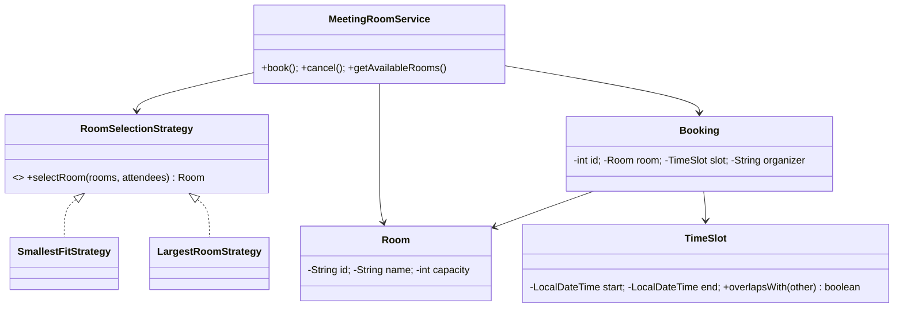

# 🏢 Meeting Room Reservation System — LLD

Design a meeting room reservation system with conflict detection and pluggable room selection using the **Strategy Pattern**.

**Problem Link:** [CodeZym #29](https://codezym.com/question/29)

## Design Patterns Used

| Pattern | Purpose | Classes |
|---------|---------|---------|
| **Strategy** | Pluggable room selection (SmallestFit, LargestRoom) | `RoomSelectionStrategy`, `SmallestFitStrategy`, `LargestRoomStrategy` |

## 🔑 Key Concepts

- **Rooms** with capacity; **TimeSlots** with overlap detection
- **Conflict detection**: no double-booking on overlapping time slots
- **Strategy**: SmallestFit (minimize waste) or LargestRoom (maximize comfort)
- **Operations**: book, cancel, list available rooms, list bookings per room

## 📂 Package Structure

```
MeetingRoom/
├── model/
│   ├── Room.java      — id, name, capacity
│   ├── TimeSlot.java  — start, end, overlapsWith()
│   └── Booking.java   — room, slot, organizer, attendees
├── strategy/
│   ├── RoomSelectionStrategy.java — interface
│   ├── SmallestFitStrategy.java   — smallest room that fits
│   └── LargestRoomStrategy.java   — largest available room
├── service/
│   └── MeetingRoomService.java    — book, cancel, availability
└── MeetingRoomMain.java
```

## 📐 UML Class Diagram



## 🚀 How to Run

```bash
javac -d out $(find MeetingRoom -name "*.java")
java -cp out MeetingRoom.MeetingRoomMain
```
