# 🅿️ Parking Lot — LLD

Design a parking lot system with multiple floors, vehicle types, and pluggable spot allocation using the **Strategy Pattern**.

**Problem Link:** [CodeZym #7](https://codezym.com/question/7)

## Design Patterns Used

| Pattern | Purpose | Classes |
|---------|---------|---------|
| **Strategy** | Pluggable spot selection algorithm (Nearest, ExactFit) | `ParkingStrategy`, `NearestSpotStrategy`, `ExactFitStrategy` |
| **SRP** | Separate models, service, and strategy | All packages |

## 🔑 Key Concepts

- **Vehicle types**: BIKE < CAR < TRUCK (ordinal-based fitting)
- **Spot fitting**: a TRUCK spot can hold a CAR or BIKE, but not vice versa
- **Ticket system**: entry/exit timestamps for each parked vehicle
- **Duplicate prevention**: same license plate cannot park twice
- **Runtime strategy swap**: change allocation algorithm without restarting

## 📂 Package Structure

```
ParkingLot/
├── model/
│   ├── VehicleType.java  — enum: BIKE, CAR, TRUCK
│   ├── Vehicle.java      — licensePlate + type
│   ├── ParkingSpot.java  — id, floor, spotType, parkedVehicle
│   └── Ticket.java       — id, vehicle, spot, entry/exit time
├── strategy/             — Strategy Pattern
│   ├── ParkingStrategy.java      — interface
│   ├── NearestSpotStrategy.java  — first available spot (lowest ID)
│   └── ExactFitStrategy.java     — smallest spot that fits (no waste)
├── service/
│   └── ParkingLotService.java    — park, unpark, status
└── ParkingLotMain.java
```

## 📐 UML Class Diagram

```mermaid
classDiagram
    class VehicleType{ <<enum>> BIKE; CAR; TRUCK }
    class Vehicle{ -String licensePlate; -VehicleType type }
    class ParkingSpot{ -int id; -int floor; -VehicleType spotType; +canFit(vehicle) }
    class Ticket{ -int id; -Vehicle vehicle; -ParkingSpot spot; -LocalDateTime entryTime }

    class ParkingStrategy{
        <<interface>>
        +findSpot(spots, vehicle) ParkingSpot
    }
    class NearestSpotStrategy
    class ExactFitStrategy

    ParkingStrategy <|.. NearestSpotStrategy
    ParkingStrategy <|.. ExactFitStrategy

    class ParkingLotService{
        -List~ParkingSpot~ spots
        -Map activeTickets
        -ParkingStrategy strategy
        +parkVehicle(vehicle) Ticket
        +unparkVehicle(plate) Ticket
        +setStrategy(strategy)
    }

    ParkingLotService --> ParkingStrategy
    ParkingLotService --> ParkingSpot
    ParkingLotService --> Ticket
    ParkingSpot --> Vehicle
    Vehicle --> VehicleType
```



## 🚀 How to Run

```bash
javac -d out $(find ParkingLot -name "*.java")
java -cp out ParkingLot.ParkingLotMain
```

## 📋 Demo Scenarios

1. **Nearest Strategy** — park 4 vehicles, first available spot used
2. **Unpark** — free a spot and verify status
3. **Switch to ExactFit** — bike gets bike spot (not car/truck)
4. **Full lot** — no spot available for truck
5. **Duplicate** — same vehicle can't park twice
