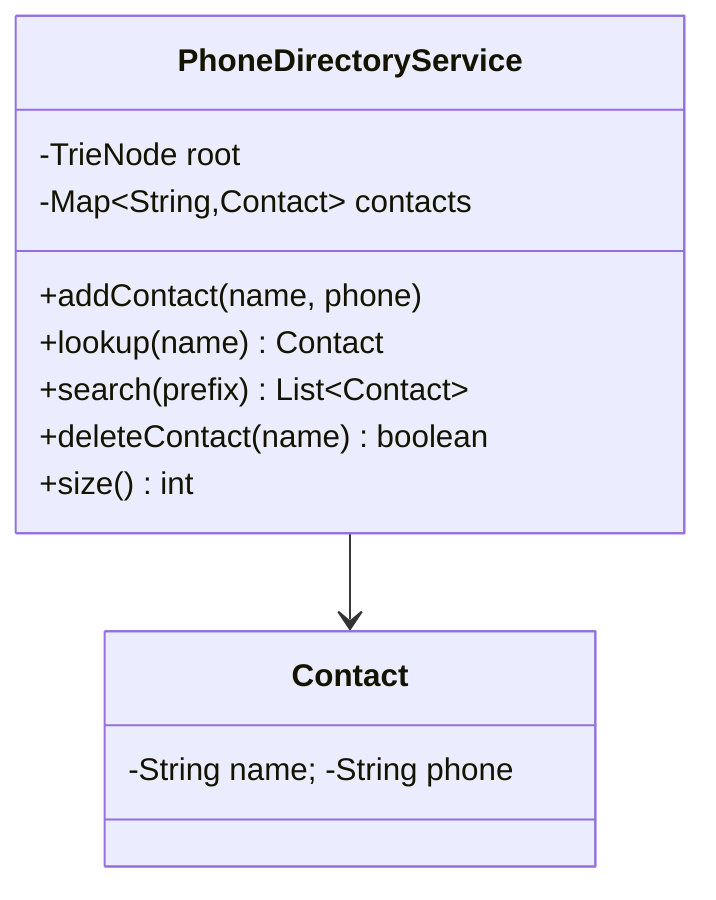

# 📱 Phone Directory — LLD

Design a phone directory with contact management and prefix-based search using a **Trie**.

**Problem Link:** [CodeZym #10379](https://codezym.com/question/10379)

## Data Structures

| Concept | Purpose | Classes |
|---------|---------|---------|
| **Trie** | Prefix-based contact name search | `PhoneDirectoryService` (inner `TrieNode`) |
| **HashMap** | O(1) exact lookup by name | `contacts` map |

## 🔑 Key Concepts

- **Add contact** with name and phone number
- **Exact lookup** by name → O(1) via HashMap
- **Prefix search** → O(k + m) via Trie traversal (k=prefix length, m=matches)
- **Case-insensitive** search
- **Delete contact** removes from HashMap (Trie entries become orphaned)

## 📂 Package Structure

```
PhoneDirectory/
├── model/
│   └── Contact.java              — name + phone
├── service/
│   └── PhoneDirectoryService.java — Trie + HashMap backed directory
└── PhoneDirectoryMain.java
```

## 📐 UML Class Diagram



## 🚀 How to Run

```bash
javac -d out $(find PhoneDirectory -name "*.java")
java -cp out PhoneDirectory.PhoneDirectoryMain
```

## 📋 Demo Scenarios

1. **Add contacts** — Alice, Bob, Charlie, Alex, Albert, Bobby
2. **Exact lookup** — find Alice, miss Unknown
3. **Prefix search** — "al" → Albert, Alex, Alice
4. **Delete** — remove Albert, verify search updates
