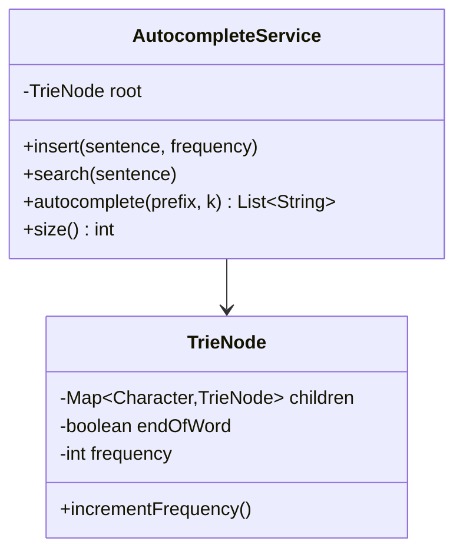

# 🔍 Google Search Autocomplete — LLD

Design a search autocomplete system with **frequency-ranked** suggestions using a **Trie**.

**Problem Link:** [CodeZym #10642](https://codezym.com/question/10642)

## Data Structures

| Concept | Purpose | Classes |
|---------|---------|---------|
| **Trie** | Prefix-based sentence storage | `TrieNode`, `AutocompleteService` |
| **Priority Queue** | Top-k results by frequency | `autocomplete()` method |
| **Frequency Tracking** | Rank suggestions by popularity | `TrieNode.frequency` |

## 🔑 Key Concepts

- **Insert sentences** with initial frequency (historical data)
- **Search** increments frequency (every search boosts ranking)
- **Autocomplete** returns top-k results sorted by frequency (descending)
- **Case-insensitive** prefix matching
- **Max-heap (PriorityQueue)** for efficient top-k extraction

## 📂 Package Structure

```
SearchAutocomplete/
├── model/
│   └── TrieNode.java            — children map, endOfWord, frequency
├── service/
│   └── AutocompleteService.java — insert, search, autocomplete(prefix, k)
└── SearchAutocompleteMain.java
```

## 📐 UML Class Diagram



## 🔄 Autocomplete Flow

```
  User types "ama"
       │
       ▼
  Traverse Trie: a → m → a
       │
       ▼
  DFS collect all complete sentences below
       │
       ▼
  PriorityQueue ranks by frequency (desc)
       │
       ▼
  Return top-k: ["amazon prime"(10), "amazon web services"(8), "amazon kindle"(5)]
```

## 🚀 How to Run

```bash
javac -d out $(find SearchAutocomplete -name "*.java")
java -cp out SearchAutocomplete.SearchAutocompleteMain
```

## 📋 Demo Scenarios

1. **Seed data** — 10 sentences with frequencies (amazon, apple, google)
2. **Autocomplete** — "ama" → top 3 amazon results by frequency
3. **Frequency boost** — 5 searches for "amazon music" promotes its ranking
4. **No match** — "xyz" returns empty list
