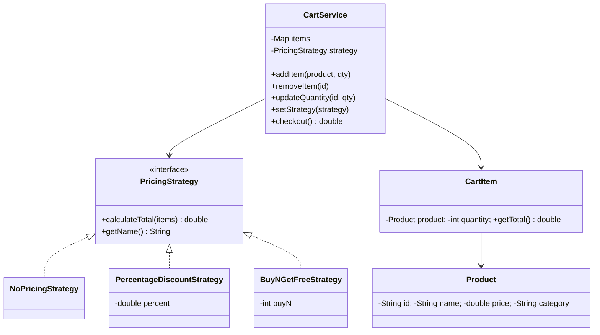

# 🛒 Shopping Cart — LLD

Design a shopping cart with pluggable pricing/discount strategies using the **Strategy Pattern**.

**Problem Link:** [CodeZym #41](https://codezym.com/question/41)

## Design Patterns Used

| Pattern | Purpose | Classes |
|---------|---------|---------|
| **Strategy** | Pluggable pricing/discount algorithms | `PricingStrategy`, `NoPricingStrategy`, `PercentageDiscountStrategy`, `BuyNGetFreeStrategy` |
| **SRP** | Separate cart management from pricing | `CartService` vs `PricingStrategy` |

## 🔑 Key Concepts

- **Product** with id, name, price, category
- **CartItem** wraps product + quantity
- **Pricing strategies** swappable at runtime:
  - **No Discount** — full price
  - **Percentage Discount** — e.g., 10% off subtotal
  - **Buy N Get 1 Free** — e.g., buy 2 get 1 free per product
- **Operations**: add, remove, update quantity, checkout

## 📂 Package Structure

```
ShoppingCart/
├── model/
│   ├── Product.java    — id, name, price, category
│   └── CartItem.java   — product + quantity + total
├── strategy/           — Strategy Pattern
│   ├── PricingStrategy.java            — interface
│   ├── NoPricingStrategy.java          — no discount
│   ├── PercentageDiscountStrategy.java — % off subtotal
│   └── BuyNGetFreeStrategy.java        — buy N get 1 free
├── service/
│   └── CartService.java — cart management + checkout
└── ShoppingCartMain.java
```

## 📐 UML Class Diagram



## 🚀 How to Run

```bash
javac -d out $(find ShoppingCart -name "*.java")
java -cp out ShoppingCart.ShoppingCartMain
```

## 📋 Demo Scenarios

1. **Add items** — laptop, mouse, book with quantities
2. **No Discount** — full price checkout
3. **10% Discount** — percentage off subtotal
4. **Buy 2 Get 1 Free** — quantity-based free items
5. **Update & Remove** — modify cart before checkout
