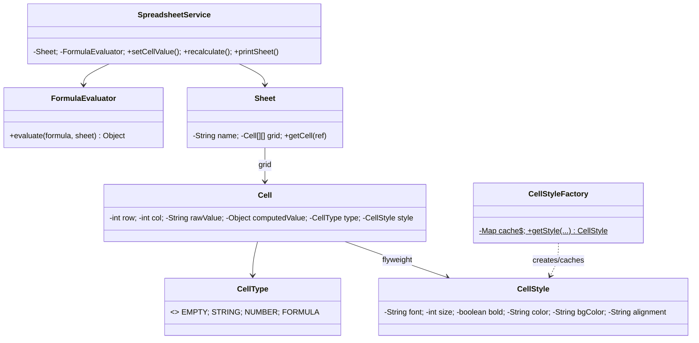

# 📊 Spreadsheet like Microsoft Excel — Low Level Design

Design a spreadsheet with cells, formulas, and formatting using the **Flyweight Pattern**.

**Problem Link:** [CodeZym #25](https://codezym.com/question/25)

## Design Patterns Used

| Pattern | Purpose | Classes |
|---------|---------|---------|
| **Flyweight** | Share `CellStyle` objects across cells with identical formatting | `CellStyle` (flyweight), `CellStyleFactory` (cache) |

## 🔑 Key Concepts

- **Cells** have a type (EMPTY, STRING, NUMBER, FORMULA)
- **Formulas** start with `=` and support: cell references (A1+B2), SUM, AVG, MIN, MAX
- **Recalculation** re-evaluates all formulas when data changes
- **CellStyle** is a flyweight — 1000 cells with same formatting share 1 style object

## 📂 Package Structure

```
Spreadsheet/
├── model/
│   ├── CellType.java   — EMPTY, STRING, NUMBER, FORMULA
│   ├── CellStyle.java  — flyweight: font, size, bold, color, alignment
│   ├── Cell.java        — row, col, rawValue, computedValue, type, style
│   └── Sheet.java       — grid of cells, cell reference parser
├── flyweight/
│   └── CellStyleFactory.java — cache for CellStyle flyweights
├── service/
│   ├── FormulaEvaluator.java  — evaluates =SUM(), =A1+B2, etc.
│   └── SpreadsheetService.java — set/get values, style, recalculate, print
└── SpreadsheetMain.java
```

## 📐 UML Class Diagram



## 🚀 How to Run

```bash
javac -d out $(find Spreadsheet -name "*.java")
java -cp out Spreadsheet.SpreadsheetMain
```
