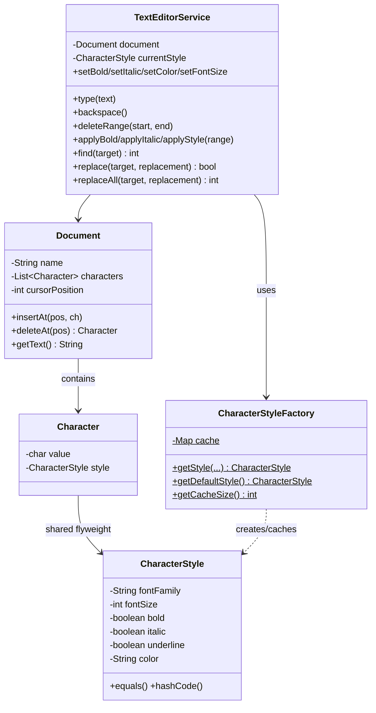

# 📝 Text Editor / Word Processor — Low Level Design

Design a text editor like Microsoft Word with character-level formatting using the **Flyweight Pattern**.

**Problem Link:** [CodeZym #9](https://codezym.com/question/9)

## Design Patterns Used

| Pattern | Purpose | Classes |
|---------|---------|---------|
| **Flyweight** | Share `CharacterStyle` objects across characters with identical formatting to save memory | `CharacterStyle` (flyweight), `CharacterStyleFactory` (factory+cache) |

## 🔑 Key Concepts

- Each character has a **value** (extrinsic) and a **style** (intrinsic/shared)
- `CharacterStyleFactory` caches `CharacterStyle` objects — if 1000 chars are all Arial/12/black, only 1 style object exists
- Operations: type, delete, backspace, cursor, formatting, find, replace

## 📂 Package Structure

```
TextEditor/
├── model/
│   ├── CharacterStyle.java  — flyweight: font, size, bold, italic, underline, color
│   ├── Character.java       — char value + style reference
│   └── Document.java        — list of characters, cursor position
├── flyweight/
│   └── CharacterStyleFactory.java — cache + factory for shared styles
├── service/
│   └── TextEditorService.java — all editor operations
└── TextEditorMain.java
```

## 🔄 Flyweight Pattern

```
Character 'H' ──┐
Character 'e' ──┤──▶ CharacterStyle{Arial/12/black} ← single shared instance
Character 'l' ──┤
Character 'l' ──┤
Character 'o' ──┘

Character 'W' ──┐
Character 'o' ──┤──▶ CharacterStyle{Arial/12/B/black} ← another shared instance
Character 'r' ──┤
Character 'l' ──┤
Character 'd' ──┘

CharacterStyleFactory cache:
  {Arial/12/black} → 1 object (shared by 5 chars)
  {Arial/12/B/black} → 1 object (shared by 5 chars)
  → 10 characters, only 2 style objects in memory!
```

## 📐 UML Class Diagram



## 🚀 How to Run

```bash
javac -d out $(find TextEditor -name "*.java")
java -cp out TextEditor.TextEditorMain
```

## 📋 Demo Scenarios

1. **Basic Typing** — Type text with default style
2. **Formatting (Flyweight)** — Bold, italic, color; shows cache reuse
3. **Cursor & Insert** — Move cursor, insert in middle
4. **Delete & Backspace** — Remove characters
5. **Find & Replace** — Search and replace operations
6. **Apply Style to Range** — Bold a word, italicize another
