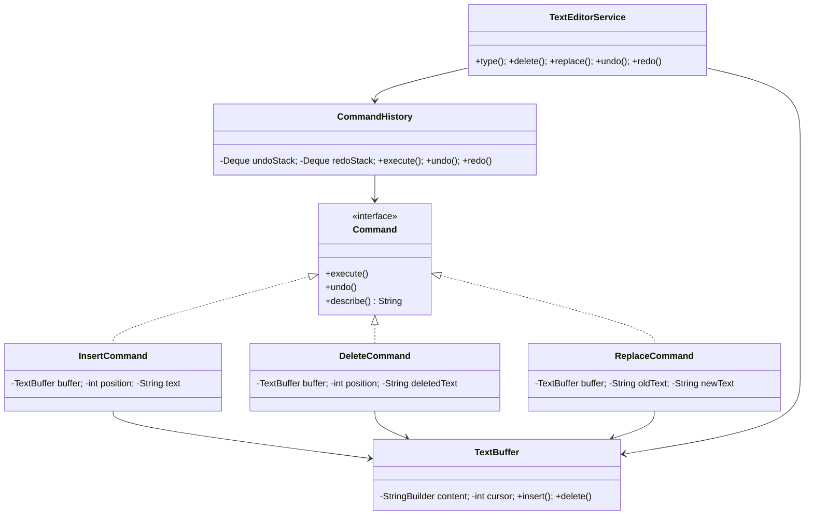

# ✏️ Text Editor with Undo/Redo — LLD

Design a text editor with undo and redo functionality using the **Command Pattern**.

**Problem Link:** [CodeZym #27](https://codezym.com/question/27)

## Design Patterns Used

| Pattern | Purpose | Classes |
|---------|---------|---------|
| **Command** | Encapsulates each edit as an object with execute()/undo() | `Command`, `InsertCommand`, `DeleteCommand`, `ReplaceCommand` |
| **SRP** | Separate command history from editor logic | `CommandHistory`, `TextEditorService` |

## 🔑 Key Concepts

- **Command Pattern**: each edit (insert, delete, replace) is a reversible command
- **Undo stack**: executed commands push onto undo stack
- **Redo stack**: undone commands push onto redo stack; new edits clear redo
- **Cursor tracking**: TextBuffer maintains cursor position for sequential typing

## 📂 Package Structure

```
TextEditorUndoRedo/
├── command/
│   ├── Command.java        — interface: execute(), undo(), describe()
│   ├── InsertCommand.java  — insert text at position
│   ├── DeleteCommand.java  — delete text (saves deleted text for undo)
│   └── ReplaceCommand.java — composite delete + insert
├── model/
│   └── TextBuffer.java     — StringBuilder wrapper with cursor
├── service/
│   ├── CommandHistory.java — undo/redo stack management
│   └── TextEditorService.java — editor facade
└── TextEditorUndoRedoMain.java
```

## 🔄 Command Flow

```
  User types "Hello"
       │
       ▼
  InsertCommand.execute()  ──▶  undoStack: [Insert"Hello"]
                                redoStack: []
  User types " World"
       │
       ▼
  InsertCommand.execute()  ──▶  undoStack: [Insert"Hello", Insert" World"]
                                redoStack: []
  User calls undo()
       │
       ▼
  InsertCommand.undo()     ──▶  undoStack: [Insert"Hello"]
                                redoStack: [Insert" World"]
  User calls redo()
       │
       ▼
  InsertCommand.execute()  ──▶  undoStack: [Insert"Hello", Insert" World"]
                                redoStack: []
```

## 📐 UML Class Diagram



## 🚀 How to Run

```bash
javac -d out $(find TextEditorUndoRedo -name "*.java")
java -cp out TextEditorUndoRedo.TextEditorUndoRedoMain
```

## 📋 Demo Scenarios

1. **Type & Undo** — type "Hello World!", undo each step
2. **Redo** — redo undone operations
3. **Type clears redo** — new edit after undo clears redo stack
4. **Delete & Replace** — delete and replace operations with undo
5. **Backspace** — cursor-aware backspace with undo
