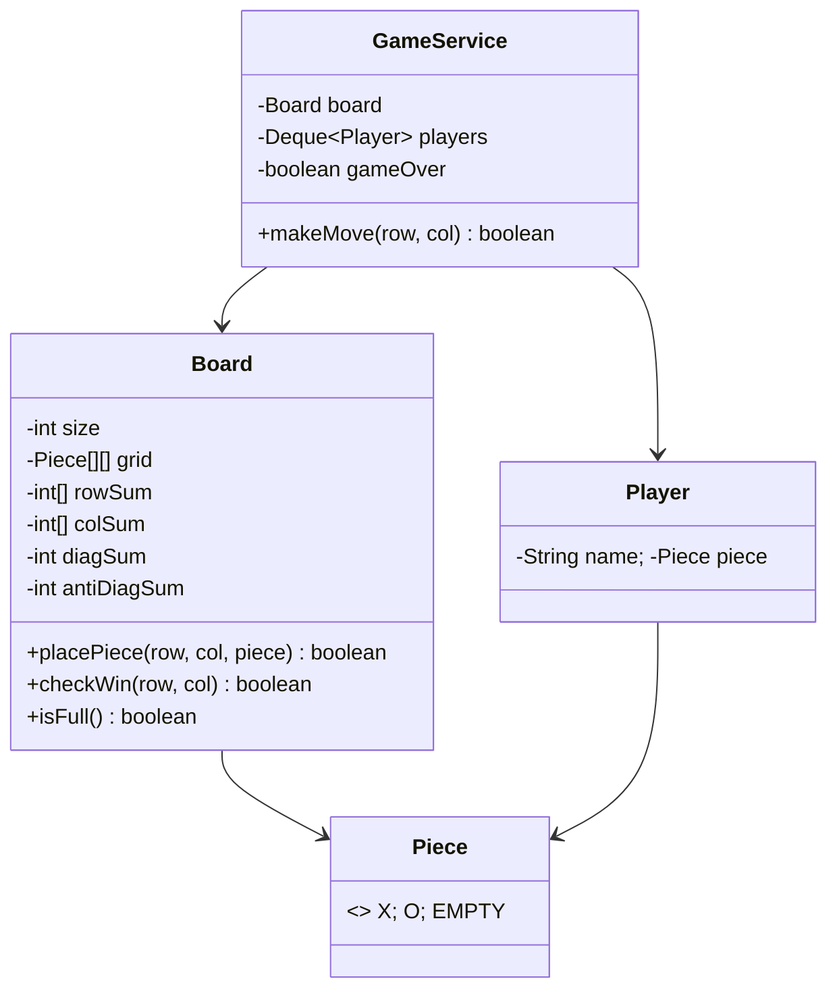

# ❌⭕ Tic-Tac-Toe — LLD

Design a Tic-Tac-Toe game with **O(1) win detection** using row/col/diagonal sum tracking.

**Problem Link:** [CodeZym #10348](https://codezym.com/question/10348)

## Design Patterns & Data Structures

| Concept | Purpose | Classes |
|---------|---------|---------|
| **O(1) Win Detection** | Track row/col/diagonal sums instead of scanning board | `Board` |
| **Player Queue** | Rotate turns using a Deque | `GameService` |

## 🔑 Key Concepts

- **N×N board** (generic, not just 3×3)
- **O(1) win check**: maintain `rowSum[]`, `colSum[]`, `diagSum`, `antiDiagSum` — X adds +1, O adds -1
- **Win** when any sum reaches +N (X wins) or -N (O wins)
- **Draw** when board is full with no winner
- **Validation**: prevents out-of-bounds and duplicate moves

## 📂 Package Structure

```
TicTacToe/
├── model/
│   ├── Piece.java    — enum: X, O, EMPTY
│   ├── Player.java   — name + piece
│   └── Board.java    — N×N grid with O(1) win detection
├── service/
│   └── GameService.java — game flow, turn rotation, win/draw checks
└── TicTacToeMain.java
```

## 📐 UML Class Diagram



## 🚀 How to Run

```bash
javac -d out $(find TicTacToe -name "*.java")
java -cp out TicTacToe.TicTacToeMain
```

## 📋 Demo Scenarios

1. **X wins** — row completion
2. **O wins** — diagonal completion
3. **Draw** — full board, no winner
4. **Invalid moves** — occupied cell, out of bounds
